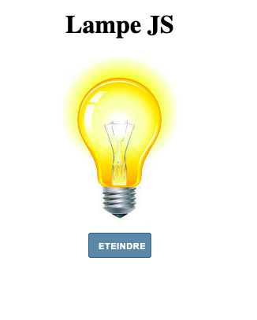

# Lampe

> Practice testing JavaScript.
Cette mini-project teste une ampoule. Elle alllume, éteind et en plus ça peut cassée en double click sur l'ampoule.

## Developpé en

- JavaScript
- HTML
- CSS

## Auteur

👤 **Neto Daniel ZINGA**

- Github: [@dannyclever](https://github.com/dannyclever)
- Email: [Neto Daniel Zinga](danielnzinga5@gmail.com)

[Version live](https://dannyclever.github.io/Lampe/)